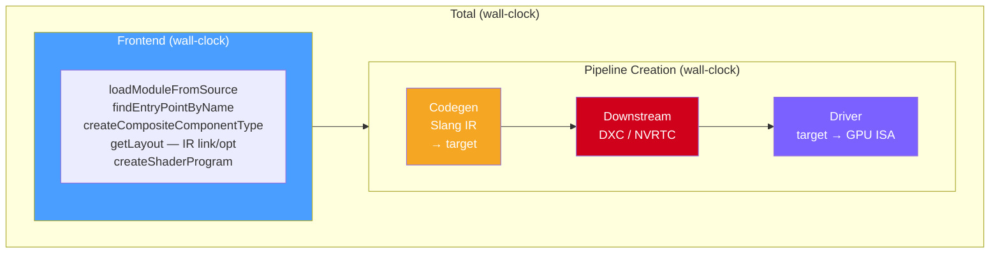

# benchmark-compile

A micro-benchmarking tool for measuring ray tracing pipeline compilation
performance across Vulkan, D3D12, and CUDA (OptiX) backends. The benchmark
generates synthetic Slang shader modules with tunable count and complexity,
compiles them into ray tracing pipelines, and reports a detailed timing
breakdown of each compilation phase.

## Latest Results

Device Type  | # Mods| Size    | Frontend(ms) |  Codegen(ms) | Downstrm(ms) |  Driver (ms) |   Total (ms) |
-------------| ------| --------| ------------ | ------------ | ------------ | ------------ | ------------ |
Vulkan       | 1     | complex |        64.72 |        40.02 |       103.99 |      8266.07 |      8474.81 |
D3D12        | 1     | complex |        57.70 |        40.72 |     14829.35 |      7158.51 |     22086.28 |
CUDA         | 1     | complex |        67.85 |        57.59 |     23345.34 |      8598.85 |     32069.62 |

Device Type  | # Mods| Size    | Frontend(ms) |  Codegen(ms) | Downstrm(ms) |  Driver (ms) |   Total (ms) |
-------------| ------| --------| ------------ | ------------ | ------------ | ------------ | ------------ |
Vulkan       | 16    | simple  |        40.65 |        30.06 |         2.24 |        74.97 |       147.91 |
D3D12        | 16    | simple  |        39.48 |        53.37 |        27.73 |        71.51 |       192.09 |
CUDA         | 16    | simple  |        39.71 |        92.38 |      1967.69 |       158.26 |      2258.04 |

**Column legend**: **Frontend** = Slang parse, type-check, link/optimize IR |
**Codegen** = Slang IR to target code (SPIR-V / HLSL / CUDA) |
**Downstream** = DXC (D3D12), NVRTC (CUDA), or N/A (Vulkan) |
**Driver** = GPU driver pipeline creation |
**Total** = end-to-end wall-clock

## Building

The benchmark is built automatically when `SLANG_RHI_BUILD_BENCHMARKS` is ON
(the default when building slang-rhi as the master project).

```bash
# Configure (using the default Ninja Multi-Config preset)
cmake --preset default

# Build
cmake --build build --config Release

# Or with MSVC (generates .sln)
cmake --preset msvc
cmake --build build-msvc --config RelWithDebInfo --target benchmark-compile
```

The executable is produced at:

```
build/<config>/benchmark-compile[.exe]
```

The CMake target is defined in the root `CMakeLists.txt` (lines 961–971). It
requires C++20 and links against `slang-rhi` and `slang`.

## Running

```bash
# Benchmark all available device types with default settings
./benchmark-compile

# Benchmark a single device type
./benchmark-compile --device vulkan
./benchmark-compile --device d3d12
./benchmark-compile --device cuda

# Pin a specific configuration
./benchmark-compile --device vk --modules 4 --size complex --iterations 10

# Run with serial (single-threaded) task pool for baseline comparison
./benchmark-compile --serial

# Enable verbose diagnostics (RHI debug callbacks + validation layers)
./benchmark-compile --verbose
```

### CLI Reference

| Flag | Description | Default |
|------|-------------|---------|
| `--device <type>` | Pin device type: `vulkan`/`vk`, `d3d12`/`dx12`, `cuda` | All available |
| `--modules <n>` | Pin closesthit module count | Auto-vary: 1, 2, 4, 8, 16 |
| `--size <level>` | Pin module complexity: `simple`, `complex` | Auto-vary both |
| `--threads <n>` | Thread pool size (0 = hardware concurrency) | 0 |
| `--iterations <n>` | Iterations per configuration | 5 |
| `--serial` | Use blocking task pool (no threads) | Off |
| `--verbose`, `-v` | Enable debug callbacks and validation | Off |
| `--help`, `-h` | Show help | — |

## Output

The benchmark prints a table with mean times for each compilation phase:

```
Device Type | # Mods| Size    | Frontend(ms) | Codegen(ms) | Downstrm(ms) | Driver (ms) | Total (ms) |
------------|-------|---------|--------------|-------------|---------------|-------------|------------|
Vulkan      | 1     | simple  |         3.21 |        1.42 |          0.00 |        5.87 |      10.50 |
Vulkan      | 1     | complex |        65.30 |       52.14 |        512.40 |       18.22 |     647.06 |
D3D12       | 1     | simple  |         3.58 |        1.55 |          6.20 |       12.01 |      23.34 |
CUDA        | 1     | simple  |         3.47 |        1.38 |         45.12 |      312.50 |     362.47 |
```

## Timing Breakdown

The benchmark reports five columns, each measuring a distinct phase of the
ray tracing pipeline compilation process. The phases are listed in execution
order.

### Phase 1: Frontend

**Column**: `Frontend(ms)`
**What it measures**: Slang frontend — parsing, type-checking, and IR
linking/optimization.
**How it's measured**: Wall-clock time around `compileModules()` in `main.cpp`
(lines 548–550). This function calls:

1. `slangSession->loadModuleFromSource()` — parses each synthetic Slang module
   (`main.cpp` lines 118–123).
2. `slangModule->findEntryPointByName()` — locates entry points
   (`main.cpp` lines 138–139).
3. `slangSession->createCompositeComponentType()` — composes modules and entry
   points (`main.cpp` lines 157–162).
4. `composedProgram->getLayout()` — **forces** Slang's IR linker to run
   immediately (`main.cpp` line 176). Without this call, linking is deferred
   into the pipeline creation phase, hiding significant IR work in the
   wrong column.
5. `device->createShaderProgram()` — creates the RHI shader program object
   (`main.cpp` lines 198).

### Phase 2: Codegen

**Column**: `Codegen(ms)`
**What it measures**: Slang backend code generation — translating Slang IR into
target-specific source code (SPIR-V for Vulkan, HLSL for D3D12, CUDA source
for OptiX).
**How it's measured**: Derived from `slang::IGlobalSession::getCompilerElapsedTime()`
snapshots taken before and after `createRayTracingPipeline()`:

```
codegenMs = slangTotalDelta - downstreamDelta
```

Where `slangTotalDelta` is the total Slang compiler time consumed during
pipeline creation, and `downstreamDelta` is the downstream compiler time
(see next phase). The difference isolates Slang's own backend codegen.
See `main.cpp` lines 569–602.

### Phase 3: Downstream

**Column**: `Downstrm(ms)`
**What it measures**: Time spent in downstream (third-party) compilers invoked
by Slang during pipeline creation:

| Backend | Downstream Compiler | Work |
|---------|---------------------|------|
| Vulkan  | *(none — Slang emits SPIR-V directly)* | Typically ~0 ms |
| D3D12   | DXC (DirectX Shader Compiler) | HLSL → DXIL |
| CUDA    | NVRTC (NVIDIA Runtime Compilation) | CUDA → PTX |

**How it's measured**: The "downstream" component of
`getCompilerElapsedTime()`. Slang internally tracks time spent calling into
external compilers and reports it separately. See `main.cpp` lines 601.

### Phase 4: Driver

**Column**: `Driver(ms)`
**What it measures**: Time the GPU driver spends creating the ray tracing
pipeline — compiling backend-specific IR (SPIR-V, DXIL, PTX) into GPU ISA
(instruction set architecture):

| Backend | Driver API Call |
|---------|----------------|
| Vulkan  | `vkCreateRayTracingPipelinesKHR` |
| D3D12   | `ID3D12Device5::CreateStateObject` |
| CUDA    | `optixModuleCreate` + `optixProgramGroupCreate` + `optixPipelineCreate` |

**How it's measured**: Derived by subtracting all Slang time from the pipeline
creation wall-clock time:

```
driverMs = pipelineWallClock - slangTotalDelta
```

This isolates the pure driver overhead. See `main.cpp` lines 604–608.

### Phase 5: Total

**Column**: `Total(ms)`
**What it measures**: End-to-end wall-clock time for the entire compilation
pipeline, from Slang source text to a usable `IRayTracingPipeline` object.
**How it's measured**: Sum of the Frontend wall-clock time and the pipeline
creation wall-clock time:

```
totalMs = frontendMs + pipelineWallClock
```

See `main.cpp` line 614. Note that `Total ≈ Frontend + Codegen + Downstream +
Driver`, but may differ slightly due to overhead outside Slang's internal
timers (e.g., RHI bookkeeping, memory allocation).

### Timing Diagram



## Defeating Compilation Caches

Getting accurate, repeatable compilation timings requires defeating caches at
every level. The benchmark employs three complementary strategies:

### 1. Globally Unique Seeds (Intra-Run)

Every iteration across every configuration (device type × module count × size
level × iteration number) gets a **globally unique seed** via an incrementing
counter (`main.cpp` lines 71–73, 529–533):

```cpp
static int globalSeedCounter = 0;
// ...
int seed = globalSeedCounter++;
```

The seed is embedded into **every** generated identifier:

- Entry point names: `rayGen_s0`, `rayGen_s1`, `closestHit_0_s0`,
  `closestHit_0_s1`, etc.
- Internal function names: `layer0_func0_0_s0`, `layer1_func2_0_s1`, etc.
- Slang module names: `module_rayGen_s0`, `module_closestHit_0_s1`, etc.

This defeats:

- **Slang's module cache**: `loadModuleFromSource` caches by module name.
  Different seeds → different names → no cache hits.
- **Driver shader caches**: Different function/entry point names produce
  different compiled binaries, so the driver cannot reuse cached ISA.
- **Cross-config contamination**: Without a global counter, `seed = iter`
  would repeat across configs (e.g., 1 module/simple/iter 0 and 2
  modules/simple/iter 0 would both use seed 0, sharing identical raygen and
  miss modules).

### 2. Driver Cache Clearing (Inter-Run)

NVIDIA drivers maintain persistent disk caches that survive process restarts.
The benchmark clears these on startup (`main.cpp` lines 691–759,
`clearDriverShaderCaches()`):

**Windows**:
- `%LOCALAPPDATA%\NVIDIA\DXCache` — D3D12 shader cache
- `%LOCALAPPDATA%\NVIDIA\GLCache` — Vulkan/OpenGL shader cache
- `%LOCALAPPDATA%\NVIDIA\OptixCache` — OptiX module cache

**Linux**:
- `~/.nv/ComputeCache` — unified NVIDIA shader cache

The function iterates each cache directory and deletes all contents using
`std::filesystem::remove_all`. This ensures that separate benchmark
invocations always measure cold-cache compilation, not warmed-up lookups.

### 3. Environment Variables (Runtime)

Before any RHI initialization, the benchmark sets environment variables to
disable driver-level caching for the duration of the process
(`main.cpp` lines 768–775):

| Variable | Effect |
|----------|--------|
| `OPTIX_CACHE_MAXSIZE=0` | Disables OptiX's in-process shader cache |

These environment variables prevent newly compiled shaders from being cached
to disk during the benchmark run, complementing the startup cache clearing.

### Why All Three?

| Strategy | Protects Against |
|----------|------------------|
| Global seeds | Slang module cache reuse; driver reuse of identical shaders within a single run |
| Cache clearing | Stale driver caches from previous runs making the first iteration artificially fast |
| Environment vars | New cache entries being written during the run (protecting later iterations) |

## Synthetic Module Generation

Modules are generated by `synthetic-modules.cpp`. Each benchmark configuration
produces a set of ray tracing modules:

- **1 raygen module** — always small (~15 lines); calls `TraceRay`
- **1 miss module** — always small (~5 lines); sets payload to black
- **N closesthit modules** — complexity controlled by `--size`:

| Size Level | Description | Approximate Lines |
|------------|-------------|-------------------|
| `simple` | Minimal closesthit shader; reads barycentrics, writes payload | ~20 |
| `complex` | Multi-layer helper functions with deep call chains, loops, and extensive local variables | ~5000+ |

The `complex` modules are designed to stress the compiler with:
- Multiple layers of helper functions (`numLayers × functionsPerLayer`)
- Deep inter-layer call chains (each layer calls all functions in the previous layer)
- Heavy use of local variables (10 per function) with varied initialization
- Computation loops with cross-variable mixing to prevent dead-code elimination

## Thread Pool

The benchmark includes a custom `ITaskPool` implementation (`thread-pool.h`,
`thread-pool.cpp`) backed by `std::thread`. It supports:

- Configurable thread count (defaults to `std::thread::hardware_concurrency()`)
- Task dependency tracking (tasks aren't scheduled until all dependencies complete)
- `waitTask()` / `waitAll()` for synchronization

This thread pool is passed to the RHI via `rhi->setTaskPool()`, allowing the
RHI backends to parallelize internal compilation work (e.g., dispatching
multiple `optixModuleCreate` calls concurrently).

Use `--serial` to disable the thread pool entirely, providing a baseline for
measuring the impact of parallelization.
