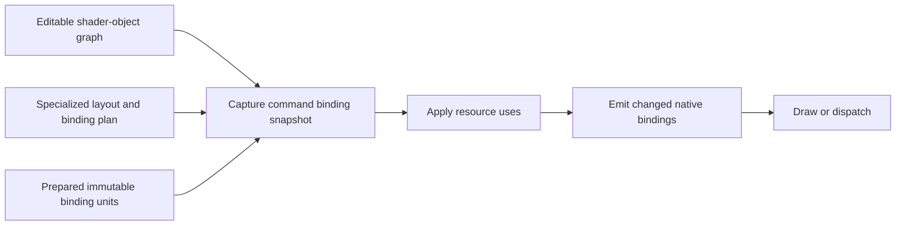

# Shader-object architecture review

Review of `30f8d1f0`, following the [focused binding study](shader-object-binding-followup.md). This is a source analysis and design proposal; it introduces no implementation changes or new performance measurements. The study measured Windows backends; Metal findings below come from source inspection only.

## Recommendation

Keep the public shader-object API and its reflection-based authoring model. Redesign the internal representation and binding composition incrementally. The current finalized-object work is useful infrastructure: immutable prepared data, explicit allocation ownership, and command-buffer retention should survive.

The central problem is the unit of reuse. We reuse a frozen object's native preparation, but still reconstruct much of its mutable parent's binding data, ownership bookkeeping, and resource-use lists. Native command emission can then rebind every child because the parent binding-data pointer changed. Meanwhile, a scalar update can force descriptor reconstruction even when resource identities are unchanged.

Separate three kinds of change: ordinary data, resource bindings, and specialization/layout. Then compose command snapshots from stable native binding units plus the data that actually changed. This does not require a new public "partially finalized" state or a generic descriptor-set abstraction across all backends.

## What the measurements establish

Changing root arguments with two reused finalized blocks improved total host time by 1.34x/1.50x on D3D12 compute/graphics, 1.43x/1.68x on Vulkan, and 1.33x/1.51x on WebGPU. CPU, CUDA, D3D11, and ray tracing also benefited, to varying degrees. These are binding-heavy tests with tiny GPU workloads, not application frame-rate predictions.

The WebGPU profiles show the remaining separation clearly. Per 1,024 calls, finalized blocks reduce native bind-group creation from 3,072 to 1,024, but leave bind-group binding at 3,072 calls. Mutable uniform upload still creates two buffers requesting 8 MiB in total. At 64 dispatches, creating and mapping those buffers cost approximately 1.08 ms in the instrumented run despite only 32 KiB of uniform data being copied.

Mutable regressions remain relevant. CPU rotating roots increased from 524.6 to 560.7 ns/call; Vulkan compute from 2,406.5 to 2,465.6 ns/call. The largest WebGPU submission regression depends on preceding allocation-heavy modes and is localized inside `wgpuQueueSubmit`. Its internal cause is unknown. Excluding fresh finalized objects removes the large submission penalty in those controls, but does not remove every graphics encoding regression involving fresh mutable objects.

Consequently, reuse is a demonstrated improvement, but neither a complete performance solution nor proof that adding more caches is the right next step. See the focused study for run ranges, phase timings, native counts, and limitations.

## Hidden costs in the current representation

### Large objects and allocation granularity

The measured `ShaderObject` size grew from 1,600 to 1,720 bytes; `RootShaderObject` grew from 1,632 to 1,752 bytes. Most of this footprint predates finalized preparation.

In [shader-object.h](../src/shader-object.h), resource slots, child references, and user-provided specialization references each use `short_vector` with its default inline capacity of 16. Every object also embeds a specialization list with two more inline arrays, including objects that never specialize. A scalar-only object pays for this representation too. Moving the new mutex and prepared cache into optional storage helps, but addresses only a small part of the footprint.

Both object classes instantiate their block allocator with `4 * 1024`. In [block-allocator.h](../src/core/block-allocator.h), this means **4,096 objects per page**, not 4 KiB. With the measured sizes, the two classes allocate approximately 6.72 and 6.84 MiB per page, respectively, excluding tiny page headers. Creating enough objects to activate one page of each class therefore requests about 13.56 MiB of CPU object storage. Pages stay allocated until explicit allocator release, currently at RHI shutdown. Every allocation and free also takes the allocator's class-wide mutex.

This is retained allocation capacity, not a GPU allocation or evidence of a leak. The free-list initialization touches blocks across each new page. Construction and multithreaded allocation costs are not established by the rotating-precreated-root benchmark. Mutable objects do not take the prepared-data mutex; the object allocator is a separate synchronization point.

**Proposal:** use layout-sized storage for slots and children, with deliberately chosen small inline capacities where justified; allocate specialization and prepared state only when needed. Prefer a small number of contiguous allocations over replacing each inline array with an independent heap allocation. Make object-pool page sizing explicit in bytes or a documented object count. Measure allocation throughput and retained capacity before adding thread-local pools.

### Eager construction of children

[ShaderObject::init](../src/shader-object.cpp) creates every statically known child, recursively. Root initialization also creates every entry-point object. The convenient `bindPipeline(pipeline)` overload creates a fresh root, so applications can construct an entire default graph only to immediately replace material parameter blocks with shared objects.

The reusable-root tests do not capture this cost. Fresh mutable roots are a plausible use case even though fresh finalized blocks are not the optimization target.

**Proposal:** first benchmark that convenience path. Subsequently consider lazy default children: materialize a child when accessed or written, and let binding preparation account for untouched defaults. This must preserve `getObject`, initialization, specialization, and recursive finalization semantics. It is a separate semantic refactor, not a safe pointer substitution to slip into an allocator change.

### Oversized binding scratch tables

[D3D12](../src/d3d12/d3d12-shader-object.cpp) and [Vulkan](../src/vulkan/vk-shader-object.cpp) each initialize a newly built root binding with capacity for 1,024 buffer states and 1,024 texture states. At 16 bytes per entry on the reviewed x64 ABI, that is **32 KiB of arena capacity per root binding**, or approximately 32 MiB over 1,024 mutable dispatches, before other binding storage. Counts start at zero; this is not a claim that all 32 KiB is written or resident on every dispatch. Frozen whole roots amortize it; mutable roots containing frozen blocks still incur it.

Metal allocates and zeroes 256 buffer pointers, 256 buffer offsets, and 256 texture pointers per new root: approximately 6 KiB on a 64-bit ABI, before sampler and resource-use storage. Its fallback resource-use arrays add more fixed capacity. D3D11 also uses dense arrays, although its native binding model makes dense slot ranges more natural.

**Proposal:** use layout-derived capacities or modest initial capacities with growth. Specialized layouts can provide tighter bounds; variable-size containers still need a fallback. This is a direct improvement that should precede a broader redesign. Batch Vulkan descriptor updates as another independent improvement: its current helper calls `vkUpdateDescriptorSets` separately for each write.

### Preparation records and composition bookkeeping

`getPreparedData<T, F>` combines cache lookup, resource retention, arena ownership, synchronization, and backend construction. Each lookup locks a recursive mutex and scans a vector. Construction can reenter preparation on the same object, for example to obtain ordinary-data storage while building a root record. CPU also creates separate root-wrapper and serialized-object records.

The cache identity consists of layout, numeric context, and a static token inside the function template. Because the template includes callback type `F`, that token depends on the callback instantiation as well as the payload type. It works for the present call sites but makes preparation role an implicit implementation detail.

Finalization allocates resource and specialization owners even when they are empty. Each prepared record adds another ownership container. Its arena has a 4 KiB default page size, allocated lazily: do not count 4 KiB for every record unconditionally. Live layout/context variants remain cached for the object's lifetime; limiting empty persistent-buffer pages does not bound these live variants.

Prepared children still generate parent work. D3D12 and Vulkan append their resource-use entries into each new parent. WebGPU retains the prepared owner and additionally takes native references to composed groups: 2,048 extra add-reference operations, with matching releases, in the two-block fixture.

**Proposal:** explicit typed preparation roles, fewer records where payload lifetimes coincide, and borrowed child payloads backed by a retained owner. Preserve separate records where sharing actually benefits callers. Use compact resource-use chunks by reference rather than copying every child list into every parent. Start with straightforward synchronized publication; there is no measurement justifying a complicated lock-free variant cache.

The [persistent buffer pool](../src/persistent-buffer-pool.cpp) also allocates a reference-counted slice object per allocation, serializes allocation/free with a mutex, scans pages on its fallback path, and creates/maps new pages under that lock. These are candidates for cold-loading and concurrent-first-use measurements, not established warm-dispatch bottlenecks. Partially occupied pages can retain substantial capacity despite the empty-page limit. Pooling more storage without tracking live versus retained bytes could hide costs instead of removing them.

### Repeated specialization, traversal, and state recording

Each draw/dispatch collects pipeline specialization arguments, obtains backend binding data, and records a set-state command before the operation. For specializable mutable roots, [getPipelineSpecializationArgs](../src/command-buffer.cpp) allocates an argument-list object per call. Layout resolution can collect the arguments again. Pipeline resolution later scans the recorded state commands; it has a warm cache and parallel deduplication, so this is not a claim that shaders compile per draw.

Mutable resource tracking separately traverses the graph and inserts strong references into `std::set`. Binding preparation traverses it again to produce descriptors, bytes, and resource states. Repeated insertion and reference-count operations have costs even when a set already contains the object. The magnitude outside the WebGPU profiles remains unmeasured.

**Proposal:** share one resolved specialization key and effective layout for each binding snapshot, retaining deferred/parallel pipeline compilation. Collect lifetime references and resource uses while packing where practical. A command-local membership structure can acquire a strong reference only on first encounter. Do not defer that acquisition until `finish()`: users can replace a mutable binding and release its old resource immediately after recording a draw.

## A smaller internal architecture

These are refinements of existing responsibilities, not four additional layers alongside them:

| Existing responsibility | Proposed form | Work removed |
| --- | --- | --- |
| `ShaderObject` | Compact editable values, resource slots, child references; optional cold state | Unused inline storage and always-present preparation machinery |
| `ShaderObjectLayout` | Layout plus precomputed backend binding plan | Repeated reflection, capacity discovery, and composition-offset calculation |
| `PreparedShaderObject` | Typed immutable native binding unit with explicit owned allocations and dependencies | Nested helper-cache records and ambiguous ownership |
| `BindingData` | Small command snapshot combining transient data and references to immutable units | Rebuilding flattened child state and treating all bindings as changed |

The layout already contains substantial useful metadata. Extend it with ordinary-data copy/patch information, resource mappings, native slot ranges, composition mappings, capacity bounds, and compatibility identity. Prefer typed arrays and ordinary backend loops over a universal binding bytecode interpreter. Specialization selects the effective plan; plans are not necessarily identical across pipelines or backends.

A native binding unit need not correspond one-to-one to a shader object. Parameter blocks are useful boundaries on descriptor-based backends; ordinary constant-buffer objects and entry points can merge into enclosing bindings. CPU and CUDA need packed memory graphs. Metal needs argument-buffer packing and residency information. Preserve these differences.

Ordinary-data allocations can be owned directly by their prepared unit when their reuse and lifetime match. If several units genuinely share the same payload, retain a separate shared payload. The goal is an understandable ownership graph, not a rule that all data must be merged.

Referenced child chunks trade copying for indirection. Keep chunks contiguous, avoid reconstructing an arbitrarily deep graph during native emission, and compare against the existing flat representation on small and deep workloads. Similarly, richer layout plans should replace repeated calculations, not merely duplicate metadata that remains in use elsewhere.

### Make data and descriptor reuse independent

Internally distinguish changes to ordinary bytes, resource identities/ranges, and specialization/child structure. One scalar version counter cannot express those differences. Updating a float should not invalidate specialization or otherwise stable texture/sampler descriptors.

However, separate counters alone are insufficient. Children are shared and mutable; a parent version does not change when an existing child is modified. Any mutable-subtree cache needs child dependency versions or immutable child snapshot identities. Avoid broad mutable-graph memoization until this contract is implemented and tested. Initially, retain the conservative mutable path and optimize composition of finalized children.

For the typical mutable-root/two-frozen-block workload, the target is:

1. Copy the changed root arguments to transient storage.
2. Capture references to the two already prepared blocks and their resource-use chunks.
3. Construct only the root's required transient native bindings.
4. Apply resource uses, then emit only native slots whose payload, offsets, or layout compatibility changed.

This removes redundant composition and binding even without changing descriptor layouts. WebGPU's current pointer-based decision in [wgpu-command.cpp](../src/wgpu/wgpu-command.cpp) instead rebinds all groups when the new parent `BindingData` pointer changes.

A subsequent backend-specific prototype can separate uniform addresses from resource descriptors more fully. Dynamic uniform offsets or suitable root descriptors may allow a stable resource binding to survive changing uniform data. This requires changes to native layouts, alignment/limit handling, and cache keys; it is not a drop-in common optimization. A different backing page, buffer range, resource, or layout may require a new binding unit. Native state comparisons must include offsets, not just descriptor/group identity. Keep the present path as a control and fallback.

## Backend priorities

| Backend | First opportunities | Architectural boundary to preserve |
| --- | --- | --- |
| D3D12 | Smaller state tables; referenced child use lists; granular root-parameter/table emission | Root signatures, descriptor-heap compatibility, root descriptors, and RT local bindings |
| Vulkan | Smaller state tables; batched descriptor writes; granular set binding | Specialized pipeline layouts, push constants, descriptor compatibility, and SBT entry-point data |
| WebGPU | Reuse ready transient upload pages; granular group emission; borrowed prepared groups | Mapping/submission lifecycle and bind-group layout compatibility |
| Metal | Layout-sized arrays; precomputed packing; referenced residency data | Argument-buffer ABI, direct slots, residency, and acceleration-structure handling; needs macOS validation |
| D3D11 | Compact used ranges; lighter root/constant-buffer preparation | Native dense slot arrays and constant-buffer offsets/counts |
| CPU | Compact objects; fewer serialized-data records; precomputed pointer patching | Host pointer graph and callable entry-point ABI |
| CUDA | Compact objects; packing plans; measure preparation separately from launch | Global versus entry-point data and CUDA-specific resource lifetime policy |

WebGPU upload-page reuse should proceed independently of the representation redesign. A queue/device pool must retain pages while recorded or in flight and return them ready for safe reuse after the relevant completion and mapping work. Merely shrinking the 4 MiB page does not eliminate creation and blocking mapping on each new command buffer. CPU time blocked in upload/submission is distinct from descriptor construction.

There is also a cold-loading opportunity: persistent WebGPU ordinary data uses dedicated initialized buffers, and buffer initialization waits for submitted work. Batching initialization for many reusable materials could help. Publication would need a real upload dependency; it cannot expose incompletely initialized buffers. This is relevant to material loading without promoting one-use finalized objects into a primary workload.

CUDA still copies module-global parameters before kernel launch. Eliminating that cost may require a different Slang-generated launch ABI, beyond a shader-object-only refactor. CPU/CUDA binding hooks currently write native handles into ordinary bytes; a fully backend-neutral authoring representation would require complete offset/stride patch metadata first. Do not remove those hooks prematurely.

## Contracts the redesign must preserve

- A recorded draw captures the arguments and references that existed at that draw, even if objects change before command-buffer finish or submission.
- Finalization continues to freeze shared children and entry points in place. Bound buffer/texture contents remain mutable; freezing references does not suppress synchronization.
- Resource-use processing is independent of native bind suppression. An unchanged writable binding can still require ordering or a barrier.
- Prepared data can outlive the authoring object through command ownership. Allocation reuse requires release by every relevant recorded/prepared owner as well as GPU completion; frame counts alone are insufficient.
- Preparation keys include effective layout, payload role, and relevant ABI/allocation context. A single "prepared" pointer is insufficient for legitimate variants.
- Concurrent reads/preparation of frozen objects need safe publication and failure handling. Do not introduce a promise of concurrent mutation of ordinary objects.
- Preserve buffer/view ranges, paired resource/sampler references, existential specialization, arrays, and RT entry-point/SBT behavior. CUDA's specialized retention policy requires a backend audit rather than substitution with generic retention.

`reserveData` already requires immediate population and forbids retaining the returned pointer. Use that contract when reasoning about invalidation. Also, `setObject` is not universally a pointer assignment: container/structured-buffer cases can copy child bytes or affect specialization. An unconditional pointer-equality early return would be incorrect.

## Implementation sequence and acceptance gates

1. **Remove demonstrable excess allocation.** Right-size D3D12/Vulkan/Metal scratch arrays, measure and adjust object storage/page granularity, and move rare state out of ordinary objects. Keep changes separate enough to identify regressions. Add convenience-root and allocation-capacity controls first. Smaller inline storage must not simply trade memory savings for many heap allocations.
2. **Fix the measured WebGPU lifecycle cost.** Implement completion-aware ready-page reuse, then granular bind-group emission and borrowed-group ownership as separate changes. Validate small batches, multiple command buffers in flight, and unusual submission order. These changes do not depend on a new public API.
3. **Make preparation/composition explicit.** Add typed roles and plan metadata, remove unnecessary nested preparation, and represent prepared child use lists by reference. Share specialization resolution within a snapshot. Migrate one backend at a time; keep native packing backend-specific. Each migration should delete old machinery rather than leave a second framework.
4. **Prototype data/resource separation.** Test dynamic-uniform binding on one suitable backend against the improved current path. Add dependency-aware invalidation only for the reuse it needs. Expand to other backends when native-call counts and normal-build timings demonstrate value.
5. **Consider semantic changes only after measurement.** Lazy default children, an optional explicit preparation/warmup API, more elaborate allocator concurrency, or a CUDA ABI change each deserve their own case. None is a prerequisite for the earlier improvements.

Preserve both the original pre-branch baseline and the current branch baseline: the next stage must demonstrate that it retains existing finalized reuse gains while improving mutable and small-batch behavior. Do not combine unrelated workloads into a single average score.

The next benchmark additions should include:

| Gap | Cases and measurements |
| --- | --- |
| Authoring cost | Fresh mutable roots through convenient `bindPipeline`; immediately replaced default children; scalar-only objects; cached offsets versus named cursors |
| Invalidation | Scalar changes with fixed resources; resource swaps with fixed types; specialization changes; mutation of shared children; unchanged repeated draws |
| Graph shape | Deep/wide graphs, resource-heavy arrays, shared blocks at different binding positions, many layouts per finalized object |
| Concurrency and memory | 1/4/16 recording threads sharing frozen blocks; cold first use; object-page capacity; preparation variants; fragmented material lifetimes; arena high-water marks |
| Command lifecycle | 1/16/64/1,024 calls per buffer; multiple frames in flight; pipeline changes; reverse submission where supported; object release and command reuse |
| Backend coverage | Compute and graphics; D3D12/Vulkan RT including local arguments; Metal on supported hardware; CUDA launch cost reported separately |

Record native creation/binding counts, requested versus used allocation bytes, bytes copied/zeroed, cache misses, and blocking upload time alongside normal-build phase timings and output checks. Contention needs an unpinned multithreaded test; the earlier single-core affinity controls cannot establish scaling. Keep isolated runs and reusable-only mixed runs, plus a realistic fresh-mutable workload to expose history effects.

## Designs to avoid

A mandatory bindless API would change capabilities and shader conventions without solving authoring size, upload lifecycle, or CPU/CUDA packing. A universal descriptor-set model would obscure backend differences. Automatic copy-on-write for every graph mutation would add allocation and dependency machinery before establishing demand. Global caches keyed by arbitrary mutable graphs would replace visible work with expensive invalidation and potentially unbounded retention.

Likewise, do not reinterpret `finalize()` as making a detached snapshot while leaving shared children mutable. If applications later need that operation, it should be a distinct API with explicit semantics.

The useful direction is narrower: compact authoring objects, layout-driven packing, explicit immutable native units, and lightweight command snapshots. It retains the successful ownership work while removing repeated parent work and allowing ordinary data to change independently of stable bindings.
